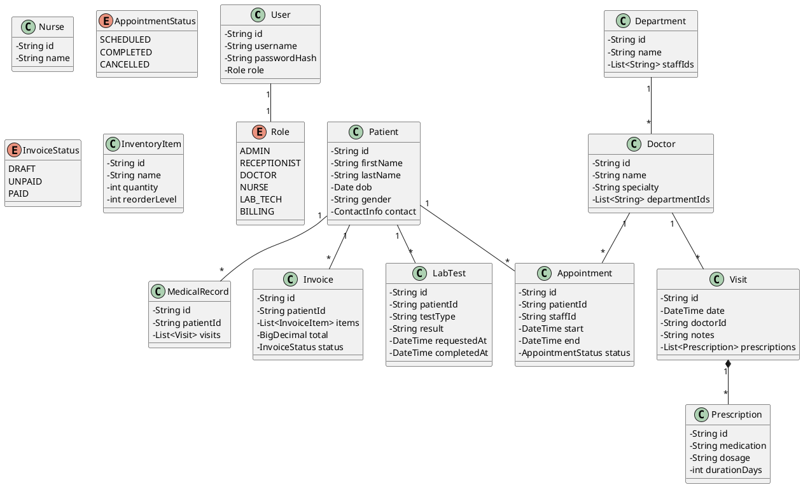
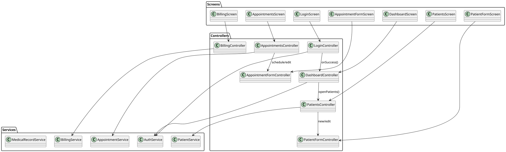

# Hospital Management System

A comprehensive hospital management system built with Java and JavaFX, implementing Object-Oriented Programming principles.

## Features

- **User Authentication**: Secure login system with role-based access control
- **Patient Management**: Complete patient records with contact information
- **Appointment Scheduling**: Schedule, update, and cancel appointments with conflict detection
- **Medical Records**: Track patient visits, diagnoses, and prescriptions
- **Billing System**: Create and manage invoices with multiple items
- **Inventory Management**: Track medical supplies and equipment
- **Lab Tests**: Request and manage laboratory tests

## Architecture

### Layered Architecture

```
┌─────────────────────────────────────┐
│         GUI Layer (JavaFX)          │
│    Controllers & FXML Views         │
├─────────────────────────────────────┤
│         Service Layer               │
│  Business Logic & Validation        │
├─────────────────────────────────────┤
│       Repository Layer              │
│  Data Access & Persistence          │
├─────────────────────────────────────┤
│         Model Layer                 │
│     Domain Entities (POJOs)         │
└─────────────────────────────────────┘
```

### Package Structure

```
com.hospital
├── model              # Domain entities
├── dto                # Data Transfer Objects
├── repository         # Data access interfaces
│   └── impl          # In-memory implementations
├── service            # Business logic
├── controller         # REST API controllers
├── gui                # JavaFX GUI
│   ├── app           # Application launcher
│   └── controller    # GUI controllers
├── util               # Utility classes
└── exception          # Custom exceptions
```

## Domain Model (PlantUML)



## GUI Architecture (PlantUML)



## Prerequisites

- Java 17 or higher
- Maven 3.6 or higher

## Installation

1. Clone the repository:
```bash
git clone <repository-url>
cd Marafie80
```

2. Build the project:
```bash
mvn clean install
```

3. Run the application:
```bash
mvn javafx:run
```

## Default Login Credentials

The system comes with pre-configured user accounts:

| Username      | Password      | Role          |
|--------------|---------------|---------------|
| admin        | admin123      | ADMIN         |
| doctor       | doctor123     | DOCTOR        |
| nurse        | nurse123      | NURSE         |
| receptionist | reception123  | RECEPTIONIST  |

## Usage

### Patient Management

1. Login with appropriate credentials
2. Navigate to "Patients" from the dashboard
3. Click "New Patient" to register a new patient
4. Fill in the required information and click "Save"
5. Search for patients using the search bar
6. Edit or delete patients as needed

### Appointment Scheduling

1. Navigate to "Appointments"
2. Click "New Appointment"
3. Select patient and doctor
4. Choose date and time
5. The system will check for scheduling conflicts
6. Click "Schedule" to confirm

### Billing

1. Navigate to "Billing"
2. Click "New Invoice" to create an invoice
3. Add items with descriptions, prices, and quantities
4. Finalize the invoice
5. Mark as paid when payment is received

## Key Services

### AuthService
- User authentication with password hashing (SHA-256)
- Role-based access control
- Session management

### PatientService
- CRUD operations for patient records
- Search functionality
- Input validation

### AppointmentService
- Schedule appointments with conflict detection
- Update appointment status (scheduled, completed, cancelled)
- Time validation (no past appointments)

### BillingService
- Create invoices with multiple items
- Calculate totals automatically
- Invoice status management (draft, unpaid, paid)

### MedicalRecordService
- Maintain patient medical history
- Add visits with notes
- Manage prescriptions

## Exception Handling

The system includes custom exceptions:

- **NotFoundException**: Resource not found
- **ValidationException**: Input validation failed
- **SchedulingConflictException**: Appointment time conflict

## Testing

Run unit tests:
```bash
mvn test
```

Run TestFX UI tests:
```bash
mvn verify
```

## Design Patterns Used

1. **Repository Pattern**: Abstracts data access layer
2. **Service Layer Pattern**: Encapsulates business logic
3. **MVC Pattern**: Separates concerns in GUI
4. **Singleton Pattern**: ServiceProvider for dependency injection
5. **Factory Pattern**: Controller creation in MainApp

## Technologies

- **Java 17**: Core programming language
- **JavaFX 20**: GUI framework
- **Maven**: Build and dependency management
- **JUnit 5**: Unit testing
- **TestFX**: GUI testing

## Internationalization

The system supports multiple languages:
- English (default)
- Arabic (RTL support planned)

Resource bundles are located in `src/main/resources/i18n/`.

## Future Enhancements

- [ ] Database persistence (replace in-memory repositories)
- [ ] REST API for external integrations
- [ ] Email notifications
- [ ] Report generation (PDF)
- [ ] Dashboard analytics and charts
- [ ] Multi-language support
- [ ] Role-based UI customization
- [ ] Audit logging
- [ ] Backup and restore functionality

## Project Structure

```
hospital-management-system/
├── pom.xml
├── HOSPITAL_SYSTEM_README.md
├── src/
│   ├── main/
│   │   ├── java/
│   │   │   └── com/
│   │   │       └── hospital/
│   │   │           ├── model/
│   │   │           ├── repository/
│   │   │           │   └── impl/
│   │   │           ├── service/
│   │   │           ├── gui/
│   │   │           │   ├── app/
│   │   │           │   └── controller/
│   │   │           └── exception/
│   │   └── resources/
│   │       ├── fxml/
│   │       ├── css/
│   │       └── i18n/
│   └── test/
│       └── java/
│           └── com/
│               └── hospital/
│                   └── service/
└── .gitignore
```

## Contributing

1. Fork the repository
2. Create a feature branch (`git checkout -b feature/amazing-feature`)
3. Commit your changes (`git commit -m 'Add amazing feature'`)
4. Push to the branch (`git push origin feature/amazing-feature`)
5. Open a Pull Request

## License

This project is licensed under the MIT License.

## Acknowledgments

- JavaFX Documentation
- Maven Central Repository
- PlantUML for diagrams
